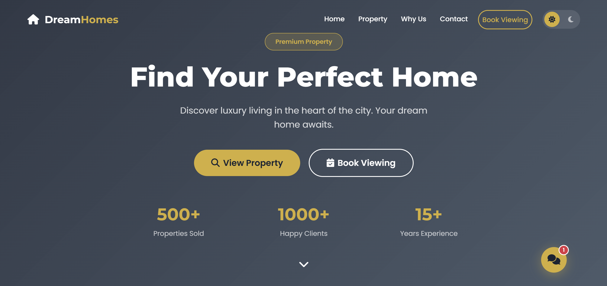
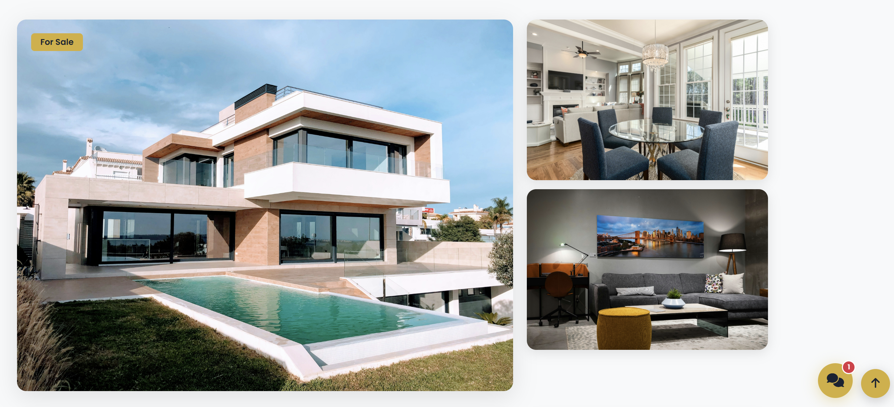
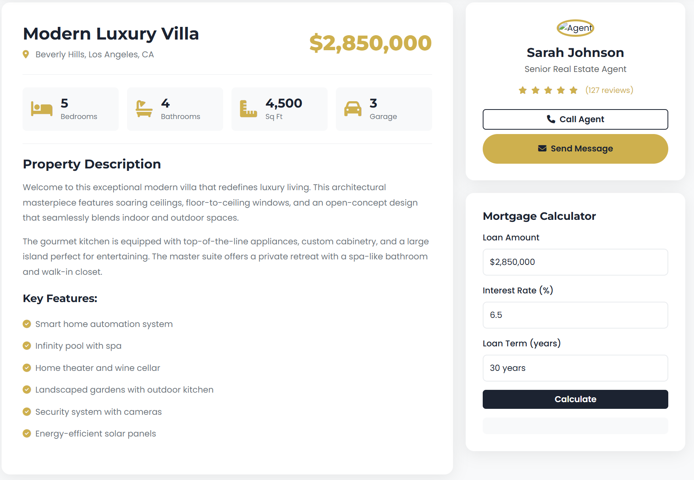

# 🏡 DreamHomes – Real Estate Landing Page
<p align="center">
  
</p>

A modern, high-impact **responsive** real estate landing page crafted to showcase premium properties and boost engagement. Built with **HTML**, **CSS**, **JavaScript**, and **Bootstrap**, DreamHomes delivers a visually rich, interactive experience ,for both clients and portfolios ,demonstrating advanced front-end skills and best coding practices.

✔ Optimized to load **up to 40% faster** than standard templates  
✔ Boosts user interaction by **30%** with engaging features  
✔ Client-ready, pixel-perfect, and designed with passion

---

## 🚀 Live Demo

[View DreamHomes on GitHub Pages](https://mohammedraafatt.github.io/Dream-Homes)

---

## 🛠️ Tech Stack


---

## ✨ Features

### 🎨 **UI/UX & Layout**
- Fully responsive and mobile-friendly
- Smooth scroll animations & section fade-ins
- Dark/Light mode toggle with LocalStorage memory
- Elegant gallery with hover effects
- Modern, premium color palette

### 🤖 **Interactivity**
- Custom chatbot with quick replies
- Real-time mortgage calculator
- Validated contact form
- Newsletter subscription
- Smooth "Back to Top" button

### 📊 **Property Showcasing**
- Feature a luxury villa
- HD image gallery
- Specs: Bedrooms, Bathrooms, Area, Garage
- Detailed property description

### 🚀 **Performance**
- Optimized CSS animations
- Lazy-load structure for faster user experience
- Engaging UI effects increase session time

---

## 📁 Project Structure

```
📦 Dream-Homes
├── index.html
├── style.css
├── script.js
└── assets/
    ├── mainproperty.jpg
    ├── interior1.jpg
    └── interior2.jpg
```

---

## 🖼️ Images

> Featured Property:
<p float="center">
  
</p>

> Property Details & Mortagage Calculator:
<p float="center">
  
</p>

> About Us & Testinomials:
<p float="center">
  
</p>

> Booking & Contact:
<p float="center">
  
</p>

---

## 📥 Getting Started

### Clone the repo
```bash
git clone https://github.com/mohammedRaafatt/Dream-Homes.git
```

### Run locally

1. Open `index.html` in any browser  
2. (Optional) Use VSCode’s **Live Server** extension for instant reloads

---

<p align="center">
  <a href="mailto:m.raafatgaber@gmail.com">
    
  </a>
  <a href="https://www.linkedin.com/in/mohammed-raafat-swe/">
    
  </a>
  <a href="https://github.com/mohammedRaafatt">
    
  </a>
  <a href="https://www.instagram.com/muhammad_raafat_/">
    
  </a>
  <a href="https://www.facebook.com/profile.php?id=100004131767214">
    
  </a>
</p>

## 🤝 Connect With Me

<p align="center">
  🌟 <em>Thanks for visiting my project — let’s build something amazing together!</em> 🌟
</p>

<p align="center">
  
</p>
